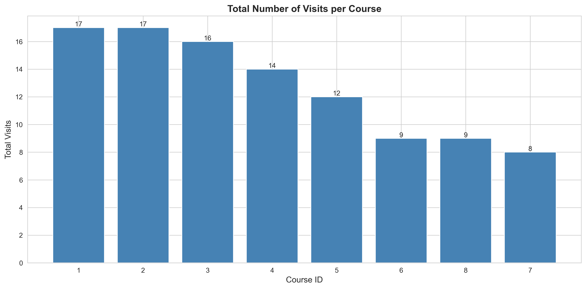
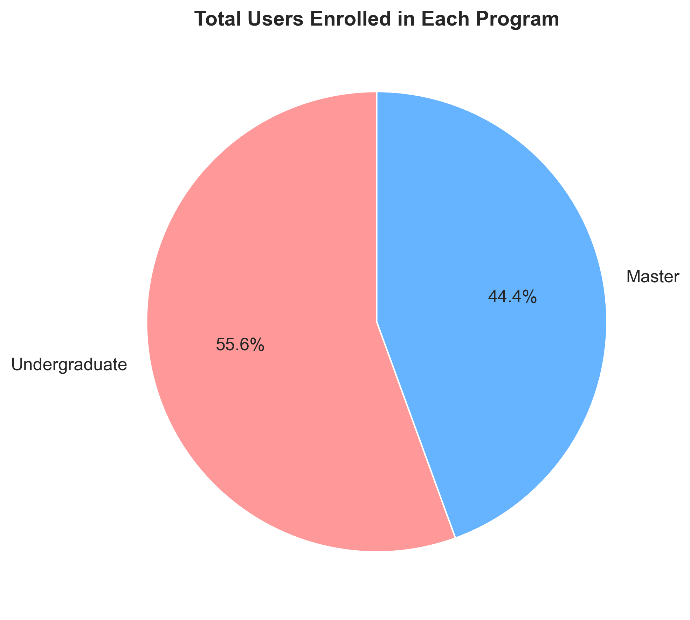
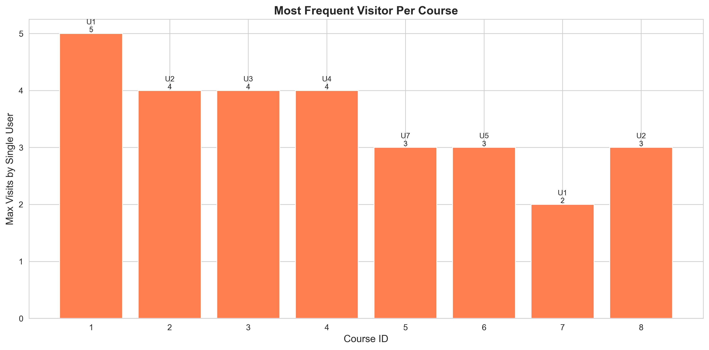

## 📋 Table of Contents
- [Overview](#overview)
- [Project Structure](#project-structure)
- [Database Schema](#database-schema)
- [Features](#features)
- [Technologies Used](#technologies-used)
- [Setup Instructions](#setup-instructions)
- [Data Analysis Queries](#data-analysis-queries)
- [Visualizations](#visualizations)
---

## 🎯 Overview

This project demonstrates advanced SQL querying capabilities for data analysis and visualization using **Microsoft SQL Server**. The assignment involves creating a database to track course site visits by users enrolled in different academic programs, followed by comprehensive data analysis and professional visualization.

### Objectives
- Design and implement a normalized relational database schema
- Populate tables with sample data meeting complex multi-criteria requirements  
- Write sophisticated SQL queries using window functions, CTEs, and advanced analytical techniques
- Visualize query results using Python data science libraries


## 📁 Project Structure

```
COMP8157-Assignment2/
├── ADTAssignment2_Complete.sql          # Complete SQL script with all queries
├── ADTAssignment2_Report.docx           # Comprehensive assignment report
├── visualize_assignment.py              # Python visualization script
├── visualizations/                      # Generated visualization images
│   ├── query_a_total_visits_per_course.png
│   ├── query_b_visits_by_program.png
│   ├── query_c_users_per_program.png
│   ├── query_d_unique_visitors.png
│   ├── query_e_recent_visits_heatmap.png
│   ├── query_f_visit_counts.png
│   ├── query_g_most_frequent_visitor.png
│   ├── query_h_single_day_visits.png
│   ├── query_i_longest_streaks.png
│   ├── query_j_longest_gaps.png
│   └── query_k_most_courses_short_duration.png
├── README_SUBMISSION.md                 # Submission guidelines and viva prep
├── push_to_github.sh                    # GitHub deployment script
└── README.md                            # This file
```

---

## 🗄️ Database Schema

### Entity-Relationship Diagram

```
┌─────────────┐
│   program   │
├─────────────┤
│ programID   │ PK
│ name        │
└──────┬──────┘
       │
       │ 1:N
       │
┌──────┴──────┐         ┌──────────────────┐
│  depCourse  │         │      users       │
├─────────────┤         ├──────────────────┤
│ courseID    │ PK      │ userID           │ PK
│ deptName    │         │ programID        │ FK
│ programID   │ FK      └────────┬─────────┘
└──────┬──────┘                  │
       │                         │
       │ 1:N                     │ 1:N
       │                         │
       └─────────┬───────────────┘
                 │
          ┌──────┴──────────────┐
          │  courseSiteVisit    │
          ├─────────────────────┤
          │ visitID             │ PK
          │ courseID            │ FK
          │ userID              │ FK
          │ date                │
          └─────────────────────┘
```

### Tables

#### `program`
Stores academic program information (Undergraduate, Master)
- **programID** (INT, PK, IDENTITY)
- **name** (VARCHAR(100), NOT NULL)

#### `depCourse`
Courses offered by departments within programs
- **courseID** (INT, PK, IDENTITY)
- **deptName** (VARCHAR(100), NOT NULL)
- **programID** (INT, FK → program)

#### `users`
Students enrolled in specific programs
- **userID** (INT, PK, IDENTITY)
- **programID** (INT, FK → program)

#### `courseSiteVisit`
Tracks each instance of a user visiting a course site
- **visitID** (INT, PK, IDENTITY)
- **courseID** (INT, FK → depCourse)
- **userID** (INT, FK → users)
- **date** (DATE, NOT NULL)

---

## ✨ Features

### Data Population Requirements ✓
- ✅ 2 departments (Computer Science, Mathematics)
- ✅ 2 programs (Undergraduate, Master)
- ✅ 2 courses per program per department (8 total courses)
- ✅ 3+ users per program (5 undergrad, 4 master = 9 total)
- ✅ 100+ visit records (102 total)
- ✅ At least 2 users visited all courses
- ✅ All users visited at least 1 course
- ✅ Multiple visits on same day per user per course
- ✅ Multiple dates per user per course

### Advanced SQL Techniques
- **Window Functions**: `ROW_NUMBER()`, `LAG()`, `LEAD()`, `PARTITION BY`
- **Common Table Expressions (CTEs)**: Multi-level nested CTEs
- **Aggregations**: `COUNT()`, `MAX()`, `SUM()`, `GROUP BY`
- **Joins**: `INNER JOIN`, `LEFT JOIN`, `CROSS APPLY`
- **Analytical Functions**: `DATEDIFF()`, `DATEADD()`
- **Subqueries**: Correlated and non-correlated subqueries

---

## 🛠️ Technologies Used

| Category | Technology | Version |
|----------|-----------|---------|
| **Database** | Microsoft SQL Server | 2022 |
| **Container** | Docker | Latest |
| **IDE** | Azure Data Studio | Latest |
| **Language** | Python | 3.12 |
| **Libraries** | pymssql | 2.3.9 |
| | pandas | 2.3.3 |
| | matplotlib | 3.10.3 |
| | seaborn | 0.13.2 |
| **Platform** | macOS | Sonoma+ |

---

## 🚀 Setup Instructions

### Prerequisites
- Docker installed and running
- Python 3.12+
- Azure Data Studio (optional but recommended)

### 1. Start SQL Server

```bash
# Pull SQL Server image
docker pull mcr.microsoft.com/mssql/server:2022-latest

# Run SQL Server container
docker run -d \
  --name sqlserver \
  -e "ACCEPT_EULA=Y" \
  -e "MSSQL_SA_PASSWORD=MyStrongPass123" \
  -p 1433:1433 \
  mcr.microsoft.com/mssql/server:2022-latest

# Verify it's running
docker ps | grep sqlserver
```

### 2. Create Database and Populate Data

**Option A: Using Azure Data Studio**
1. Connect to `localhost,1433` with username `sa` and password `MyStrongPass123`
2. Open `ADTAssignment2_Complete.sql`
3. Execute the entire script

**Option B: Using Command Line**
```bash
docker exec -it sqlserver /opt/mssql-tools/bin/sqlcmd \
  -S localhost -U sa -P "MyStrongPass123" \
  -i ADTAssignment2_Complete.sql
```

### 3. Install Python Dependencies

```bash
pip3 install pymssql pandas matplotlib seaborn
```

### 4. Run Visualization Script

```bash
python3 visualize_assignment.py
```

This will generate 11 PNG visualizations in the `visualizations/` folder.

---

## 📊 Data Analysis Queries

### Query A: Total Course Visits
Calculates total number of visits for each course across all users.
```sql
SELECT c.courseID, c.deptName, p.name AS programName, COUNT(*) AS TotalVisits
FROM courseSiteVisit csv
JOIN depCourse c ON csv.courseID = c.courseID
JOIN program p ON c.programID = p.programID
GROUP BY c.courseID, c.deptName, p.name
ORDER BY TotalVisits DESC;
```

### Query B: Visits by Program
Categorizes course visits by program for comparative analysis.
```sql
SELECT p.name AS ProgramName, c.courseID, c.deptName, COUNT(*) AS TotalVisits
FROM courseSiteVisit csv
JOIN depCourse c ON csv.courseID = c.courseID
JOIN program p ON c.programID = p.programID
GROUP BY p.name, c.courseID, c.deptName
ORDER BY p.name, TotalVisits DESC;
```

### Query C: Users per Program
Counts enrolled users in each program.
```sql
SELECT p.programID, p.name AS ProgramName, COUNT(u.userID) AS TotalUsers
FROM program p
LEFT JOIN users u ON p.programID = u.programID
GROUP BY p.programID, p.name;
```

### Query D: Unique Visitors per Department
Identifies distinct users who engaged with each department.
```sql
SELECT c.deptName, p.name AS ProgramName, COUNT(DISTINCT csv.userID) AS UniqueVisitors
FROM courseSiteVisit csv
JOIN depCourse c ON csv.courseID = c.courseID
JOIN program p ON c.programID = p.programID
GROUP BY c.deptName, p.name;
```

### Query E: Most Recent Visit Dates
Tracks last engagement date for each user-course combination using MAX aggregate.

### Query F: User Visit Counts
Calculates how many times each user visited each course.

### Query G: Most Frequent Visitors
Uses `ROW_NUMBER()` window function to identify most engaged user per course.

### Query H: Single Day Maximum Visits
Finds highest number of times any user visited a course in a single day.

### Query I: Longest Visit Streaks
Complex query using `LAG()` window function to calculate consecutive day engagement.

### Query J: Longest Gaps Between Visits
Uses `LEAD()` window function to identify periods of inactivity.

### Query K: Most Courses in Short Duration
Sophisticated query using `CROSS APPLY` to find users accessing most courses in 3-day window.

---

## 📈 Visualizations

All visualizations are generated at **300 DPI** resolution using professional color schemes and clear labeling.

### Visualization Types
| Chart Type | Queries | Purpose |
|------------|---------|---------|
| **Bar Charts** | A, B, G, H | Compare discrete values |
| **Pie Chart** | C | Show proportional distribution |
| **Heatmap** | E | Display temporal patterns |
| **Horizontal Bars** | F, I, J | Rank top-N results |

### Sample Visualizations

#### Query A: Total Course Visits


#### Query C: Users per Program  


#### Query G: Most Frequent Visitors


📁 **[View All Visualizations](visualizations/)**

---

## 🎯 Results

### Key Findings

1. **Course Popularity**
   - Computer Science courses received 17 visits (highest)
   - Mathematics courses averaged 9-12 visits
   - Undergraduate courses showed higher engagement than Master courses

2. **User Engagement**
   - Users 1 and 2 demonstrated exceptional engagement across all courses
   - Average user visited 2-4 courses
   - Most engaged users maintained 4-day consecutive streaks

3. **Engagement Patterns**
   - Peak engagement: 2 visits per course per day
   - Longest gap: 18 days (User 5, Course 6)
   - Most courses in 3 days: 7 courses (User 2)

4. **Department Analysis**
   - Both departments achieved 6 unique visitors
   - Cross-program engagement observed
   - Computer Science maintains strong appeal across both programs

### Database Statistics
- **Programs**: 2
- **Departments**: 2
- **Courses**: 8
- **Users**: 9 (5 undergrad, 4 master)
- **Total Visits**: 102

